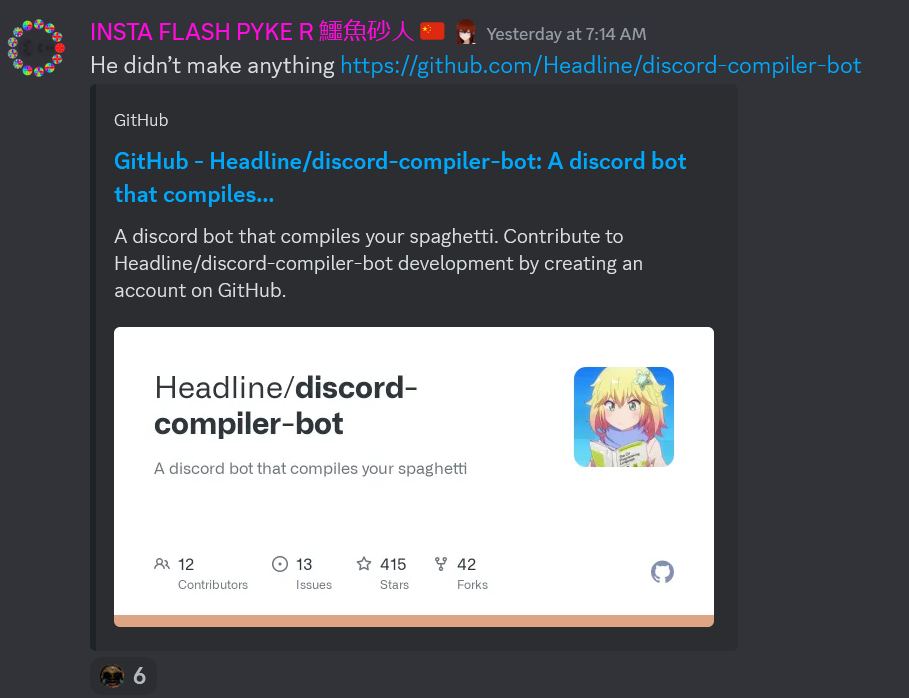

# INVICTUS IS AFTER ME


## Introduction 
This bot corrects all users saying **Invictus** (which is wrong) to **Incel Invictus** (which is correct)

## Installation and Running

```sh
 $ vim index.js 

# ... change the Discord API bot token in index.js ...

 $ npm install
 $ node index.js
```

## License
Not Lukyon &copy; 2024 AGPL
